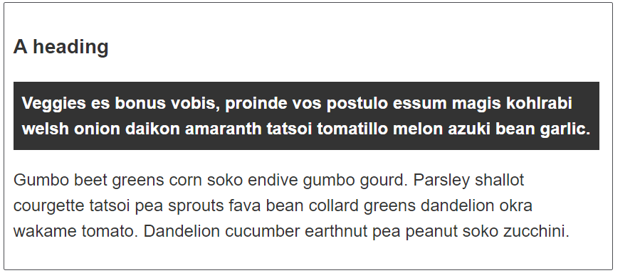
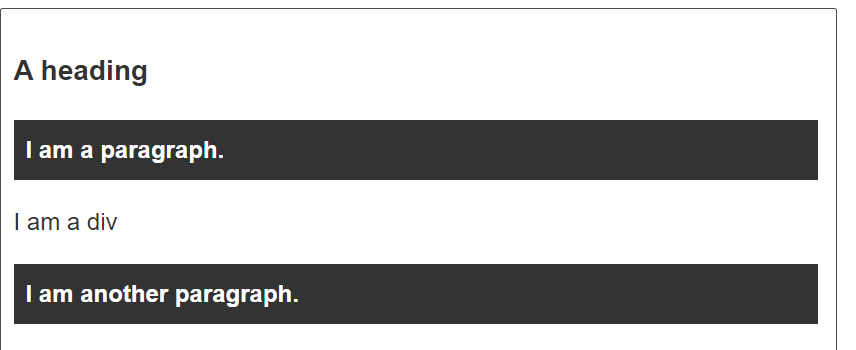

## Combinators

Combinators in CSS allow you to combine multiple selectors to target elements based on their relationship with other elements. There are four types of combinators:

- descendant(বংশধর),
- child,
- adjacent sibling(সন্নিহিত ভাইবোন),
- general sibling.

Here's a detailed documentation-style summary with examples for each combinator:

---

## Combinators

Combinators are symbols used in CSS selectors to specify the relationship between two or more elements. They allow you to target elements based on their hierarchical relationship in the HTML document.

### Descendant combinator (Whitespace)

The descendant combinator selects all elements that are descendants of a specified element.

- Example:
  
  ```css
  div p {
      color: blue;
  }
  ```

### Child combinator (`>`)

The child combinator selects all elements that are direct children of a specified element.

- Example
  
  ```css
  ul > li {
      list-style-type: none;
  }
  ```

### Adjacent sibling combinator (`+`)

The adjacent sibling combinator selects an element that is immediately preceded by a specified element.

- Example:

```css
  h2 + p {
    margin-top: 0;
    font-weight: bold;
    background-color: #333;
    color: #fff;
    padding: .5em;
  }
```

```html
<article>
    <h2>A heading</h2>
    <p>
        Veggies es bonus vobis, proinde vos postulo essum magis kohlrabi welsh onion daikon amaranth tatsoi tomatillo melon azuki bean garlic.
    </p>
    <p>
        Gumbo beet greens corn soko endive gumbo gourd. Parsley shallot courgette tatsoi pea sprouts fava bean collard greens dandelion okra wakame tomato. Dandelion cucumber earthnut pea peanut soko zucchini.
    </p>
</article>
```


### General sibling combinator (`~`)

The general sibling combinator selects all elements that are siblings of a specified element, and are preceded by the specified element.

- Example:
  
```css
  h1 ~ p {
      font-style: italic;
  }
```

```html
<article>
  <h1>A heading</h1>
  <p>I am a paragraph.</p>
  <div>I am a div</div>
  <p>I am another paragraph.</p>
</article>
```

---

### Resources

- **MDN Web Docs**: [Combinators](https://developer.mozilla.org/en-US/docs/Web/CSS/CSS_Selectors#Combinators)
- **CSS Tricks**: [Child and Sibling Selectors](https://css-tricks.com/child-and-sibling-selectors/)
- **W3C Specification**: [Selectors Level 3 - Combinators](https://www.w3.org/TR/selectors-3/#combinators)

These resources offer comprehensive explanations and examples for using combinators effectively in CSS.
